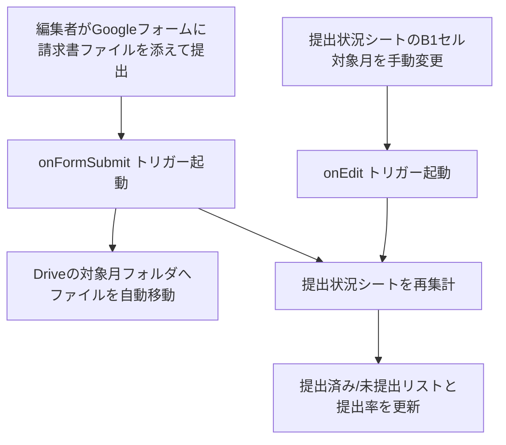

# 編集チーム請求書管理システム

Google スプレッドシート・フォーム・Drive を組み合わせて、業務委託編集者からの毎月の請求書提出を自動化する Google Apps Script (GAS) 製ツールです。

## 背景・課題

複数名の業務委託編集者から毎月請求書を集める運用では、以下のような手間が発生しがちです。

- 提出物（PDF等）がメールやチャットに散在し、月ごと・人ごとに整理されていない
- 誰が提出済みで誰がまだなのか、都度手作業で確認する必要がある
- 集計のためにスプレッドシートを毎回手で更新している

本ツールは Google フォームを提出窓口にすることで、**提出・保存・集計を自動化**します。

## 主な機能

- **フォーム提出 → Drive自動格納**: 添付された請求書ファイルを「請求対象月」ごとのフォルダへ自動振り分け
- **提出状況の自動集計**: 編集者マスターと突き合わせ、対象月ごとの提出済み／未提出人数・提出率をリアルタイム表示
- **重複提出への対応**: 同月に複数回提出された場合は最新の提出のみを有効な提出として扱う
- **カスタムメニュー**: スプレッドシート上のメニューから初期セットアップ・フォーム連携・選択肢更新・再集計をワンクリックで実行
- **エラーログ**: 処理中の例外を専用シートに記録し、運用中の不具合追跡を容易に

## 処理の流れ



## ディレクトリ構成

```
.
├── AppsScript/              # Google Apps Script プロジェクト本体（clasp管理）
│   ├── appsscript.json      # マニフェスト（タイムゾーン・OAuthスコープ等）
│   ├── .clasp.json.example  # clasp設定のテンプレート（実ファイルは.gitignore対象）
│   ├── Config.gs            # シート名・フォーム項目名などの定数定義
│   ├── Setup.gs             # 初期セットアップ処理
│   ├── Menu.gs              # カスタムメニュー・フォーム選択肢同期
│   ├── CreateForm.gs        # Googleフォームの新規作成・連携
│   ├── FormTrigger.gs       # フォーム送信時トリガー処理
│   ├── DriveUtil.gs         # Driveフォルダ操作（月別フォルダの作成・ファイル移動）
│   ├── StatusUpdater.gs     # 提出状況シートの集計ロジック
│   └── ErrorLog.gs          # エラーログ記録
├── LICENSE
└── README.md
```

## 技術スタック

- **Google Apps Script (V8 runtime)**
- **Google Sheets API / Drive API / Forms API**（`SpreadsheetApp` / `DriveApp` / `FormApp` 各サービス経由）
- **PropertiesService** によるスクリプトプロパティ管理（Driveフォルダ ID の永続化など）
- **[clasp](https://github.com/google/clasp)**（ローカル開発・デプロイ用CLI、任意）

## セットアップ手順

このツールは特定のスプレッドシート・フォームに紐づくコンテナバインド型スクリプトです。自分の環境で使う場合は以下の手順でセットアップしてください。

### 1. スプレッドシートとスクリプトの準備

1. 新規にGoogleスプレッドシートを作成する
2. 「拡張機能」→「Apps Script」でスクリプトエディタを開く
3. `AppsScript/` 配下の `.gs` ファイルと `appsscript.json` の内容をそれぞれ同名のファイルとしてコピーする

### 2. （任意）clasp を使う場合

```bash
npm install -g @google/clasp
clasp login

cd AppsScript
cp .clasp.json.example .clasp.json
# .clasp.json の scriptId を、自分のGASプロジェクトのIDに書き換える
clasp push
```

`.clasp.json` は環境固有の情報（スクリプトID）を含むため `.gitignore` で除外しています。

### 3. フォームの用意

- 既存のフォームがあればスプレッドシートと回答連携させておく
- ない場合は、スプレッドシートのカスタムメニュー「請求書管理」→「新規フォームを作成して連携」で自動作成できる
  - 質問項目: `編集者名` / `請求対象月` / `請求書ファイル` / `備考`

### 4. 初期セットアップの実行

スプレッドシートを開き、カスタムメニュー「請求書管理」→「**初期セットアップ実行**」を実行します。

- 必要なシート（`フォーム回答` / `編集者マスター` / `提出状況` / `ログ`）を自動作成
- 請求書ファイルの格納用Driveフォルダを作成
- フォーム送信トリガーを登録

初回実行時、OAuth権限の承認ダイアログが表示されるので許可してください。

### 5. 編集者マスターの登録

「編集者マスター」シートに `編集者名 / メールアドレス / 状態` を入力します（`状態` に「退職」と入れると集計対象から除外されます）。

登録後、メニュー「**編集者名の選択肢をフォームに反映**」を実行すると、フォームの選択肢に反映されます。

### 6. 運用

- 編集者はフォームから毎月請求書を提出
- 「提出状況」シートで自動的に提出済み／未提出・提出率を確認可能
- 対象月を変更したい場合は「提出状況」シートのB1セルを書き換えると自動再集計される

## セキュリティ・公開に関する注意

- スプレッドシートID・フォームURL・DriveフォルダID等はコード中にハードコードせず、実行時に `getActiveSpreadsheet()` / `getFormUrl()` / `PropertiesService` から動的に取得する設計としています
- `.clasp.json`（スクリプトID等の環境固有情報）はリポジトリに含めていません

## ライセンス

[MIT License](./LICENSE)
